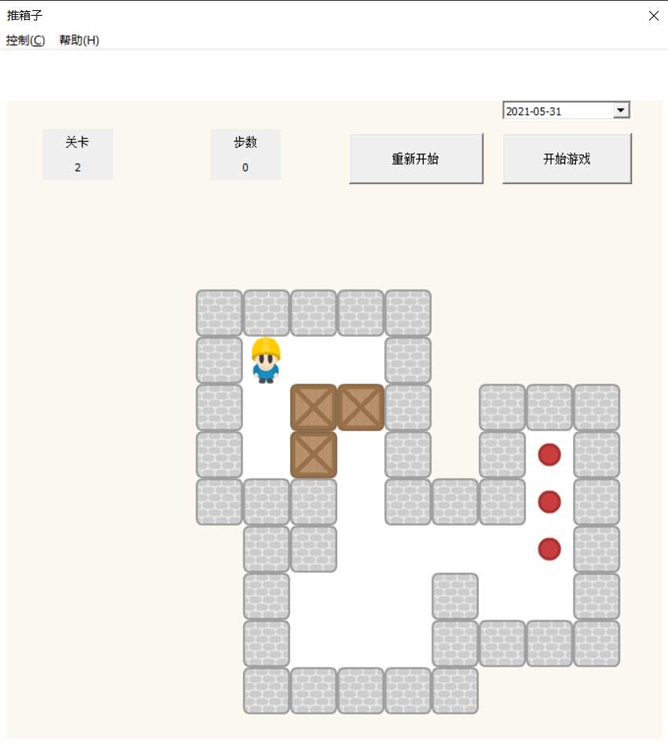
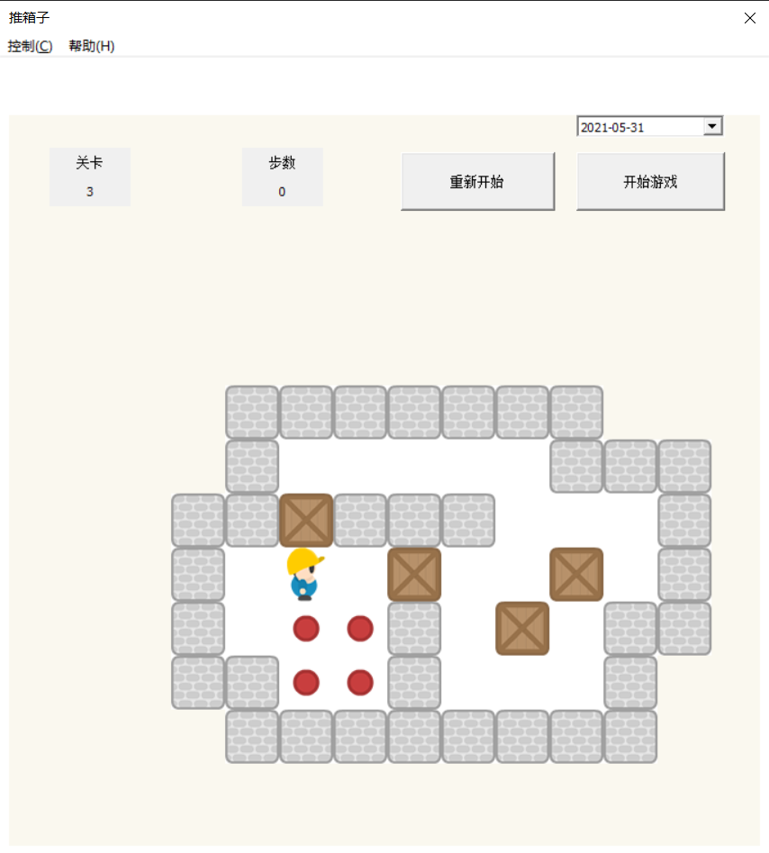

# 🎮Sokoban 
**[Assembly project]** BIT junior year's second semester course project-Sokoban  
 
## Environment

1. Visual Studio 2019  & 32-bit assembly environment
2. Create a new assembly empty project

How to configure the assembly environment is detailed in [this blog](https://blog.csdn.net/weixin_43794327/article/details/117320493?spm=1001.2014.3001.5501)

## Place the project files correctly

Respectively copy and paste the files in the **source** and **resource** folders to the corresponding **header** file, **source** file and **resource** file of VS2019.

==Note that you should copy and paste==


## Project display

|                     Level1                                |                           Level2                          |
|:---------------------------------------------------------:|:---------------------------------------------------------:|
|                                    |                                    |

|                    Level3                                 |                            Level4                         |
|:---------------------------------------------------------:|:---------------------------------------------------------:|
|                                    |                   |


The remaining levels will not be displayed too much, waiting for you to explore by yourself~

## How to operate
```
The arrow keys control the movement of the villain up, down, left, and right
        on
        ↑
  Left← ↓ →right
        Down

Click "重新开始" to return to the first level
Click "开始游戏" to restart the current level
```

---
## About Us
Author: Gong Hailong · [@Blog](https://blog.csdn.net/weixin_43794327?spm=1019.2139.3001.5343) · [@GitHub](https://github.com/TommyGong08)
Leader: [@Ge Xingtong](https://github.com/MonsterGe)
team members:   
[@Xu Siyuan](https://github.com/mcube-12139)
[@Wang Yingming](https://github.com/smartoooo)
[@Gong Hailong](https://github.com/TommyGong08). 