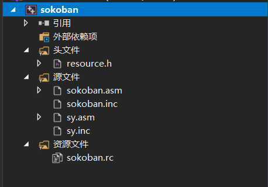
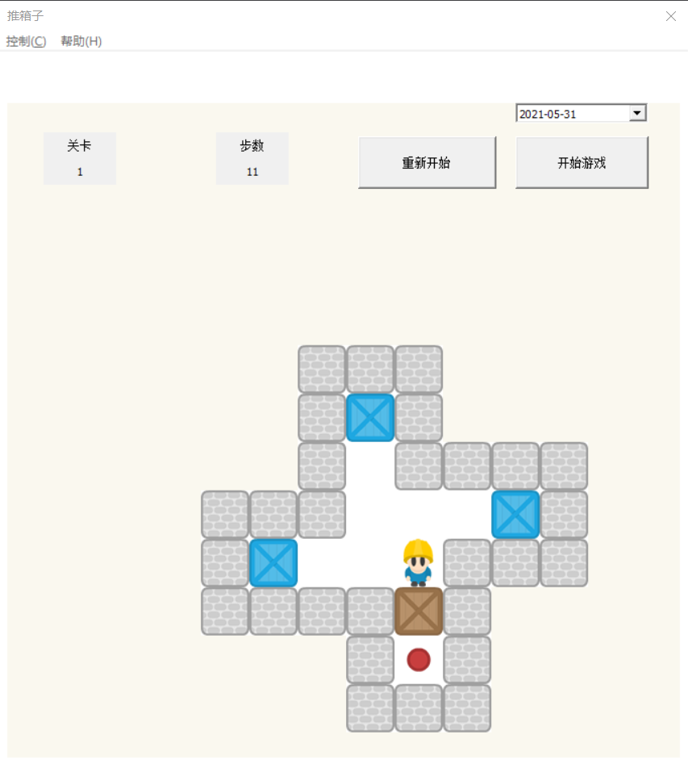
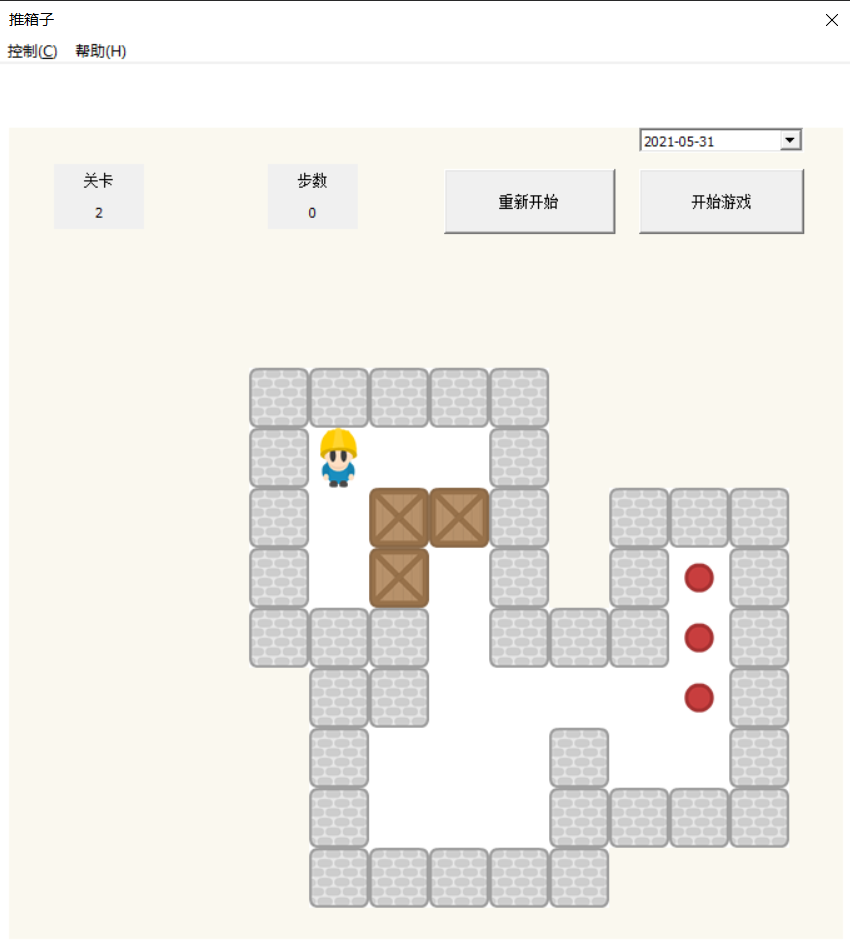
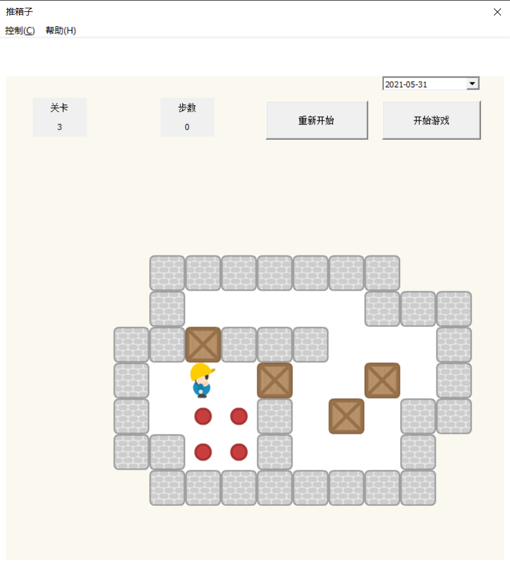
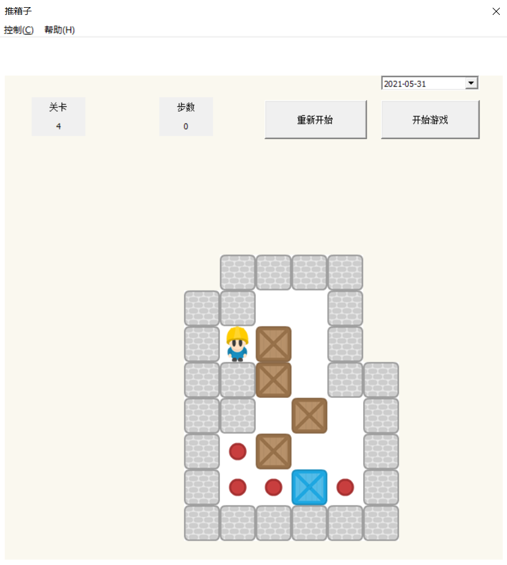

# 🎮Sokoban 
【汇编项目】BIT大三下学期课程项目——推箱子  
爷青回！！！  
[README.md in English](https://github.com/TommyGong08/Sokoban/blob/main/English.md)
 
## 配置汇编环境 

1. Visual Studio 2019配置32位汇编环境
2. 新建汇编空项目

如何配置汇编环境详见[本篇博客（保姆级教程）](https://blog.csdn.net/weixin_43794327/article/details/117320493?spm=1001.2014.3001.5501)  

## 正确放置项目文件  

分别将source,resource文件夹下的文件**复制粘贴**至VS2019对应的头文件、源文件和资源文件下。

==注意是复制粘贴==



## 项目展示


|                     Level1                                |                           Level2                          |
|:---------------------------------------------------------:|:---------------------------------------------------------:|
|                                    |                                    |

|                    Level3                                 |                            Level4                         |
|:---------------------------------------------------------:|:---------------------------------------------------------:|
|                                    |                   |


剩下的关卡就不过多展示了，等待你自己探索~

## 如何操作
```
方向键上下左右控制小人移动  
        上
        ↑
  左←   ↓   →右
        下  

点击"重新开始"回到第一关  
点击"开始游戏"重新开始当前关卡  
```

---
## About Us 
作者：Gong Hailong · [@Blog](https://blog.csdn.net/weixin_43794327?spm=1019.2139.3001.5343) · [@GitHub](https://github.com/TommyGong08)  
组长： [@Ge Xingtong](https://github.com/MonsterGe)    
小组成员：   
[@Xu Siyuan](https://github.com/mcube-12139)     
[@Wang Yingming](https://github.com/smartoooo)   
[@Gong Hailong](https://github.com/TommyGong08).   


